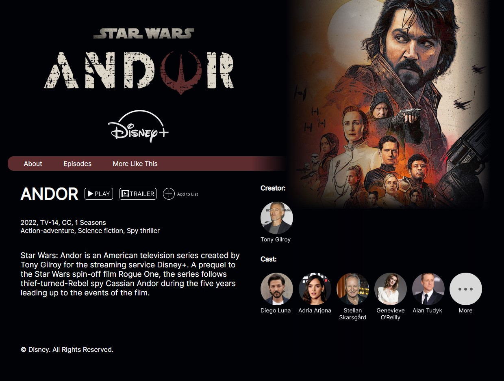

# Andor Website

# {{title}}

  

  <h2>Andor Website</h2>
  

      2022
       
      Figma, Atom, Github
  

  

      I created this website around “Andor” - a series I love. My goal was to 
      create a clear About page and Episodes’ guide. I started by prototyping 
      the layout on Figma and translated it into a functional HTML/CSS/JS page 
      with Atom. Below is a link to the website.
  

  

      Link to Website: <a href="https://alecardena.github.io/mmp240/midterm/index.html">https://alecardena.github.io/mmp240/midterm/index.html</a>  
  

