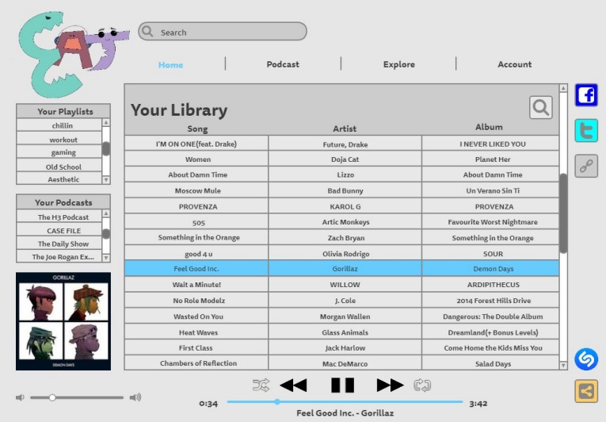

    
    
    
    
    
    
    
    

    <h2>EAT Music Website Layout</h2>
    

        2022
         
        Figma, Adobe Photoshop
    

    

        For this project, I was part of a group tasked with creating a business model, ad, storyboard,
        wireframe, and mock-up for a streaming service. We chose to create an affordable music-streaming
        website. I was in charge of creating the wireframes and mock-ups. I used Figma to do so. I also
        used Photoshop to edit some of the images.
    

