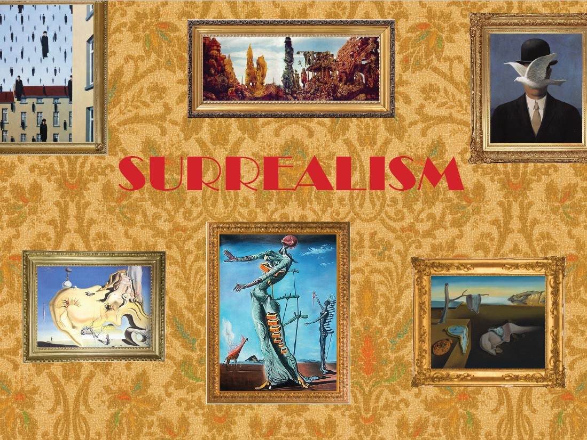
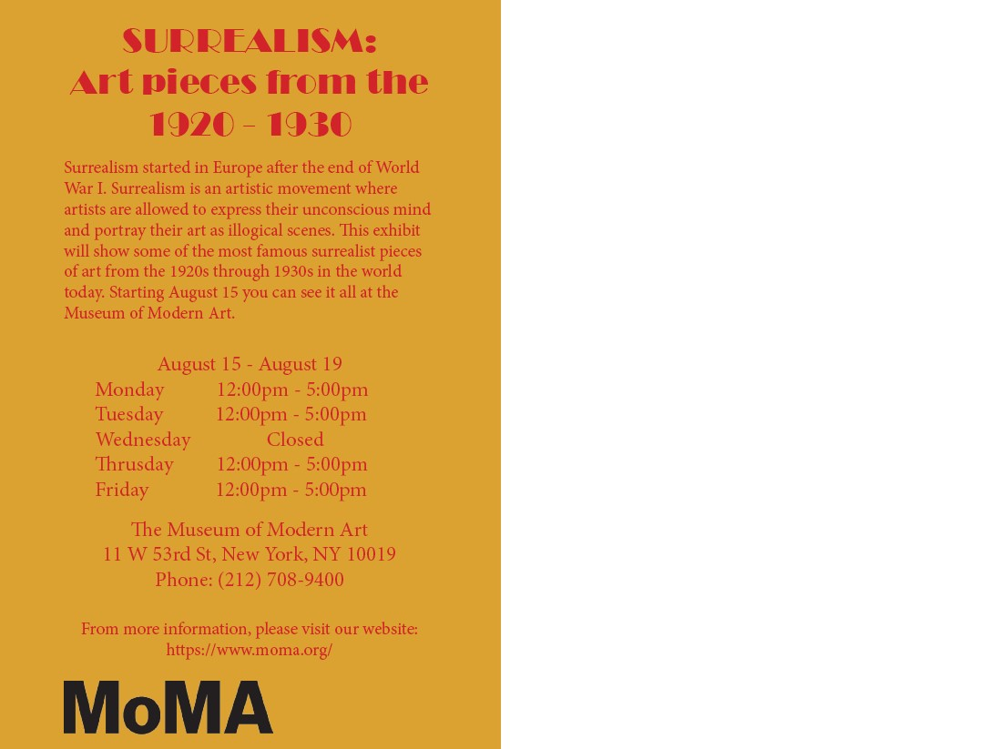

    
    

    <h2>Surrealism Postcard</h2>
    

        2022
         
        Adobe Indesign
    

    

        This is a postcard created for a hypothetical museum exhibit. I chose to center
        mine around Surrealism at MoMA and used InDesign to create the layout. My goal 
        for the front of the postcard was to create a wall that has different paintings 
        hanging on it. Those painting begin from the surrealism time period. For the wall 
        I looked up how the walls were for 1920s which was the when surrealism era was 
        taking place. I saw that wallpaper was a popluar thing at that time so I picked 
        something similer to what a wallpaper at that time would look like. I also but 
        each painting in a frame to make it look more real. The font and color I choses 
        I feel goes along with that time period and put everything together.
    

